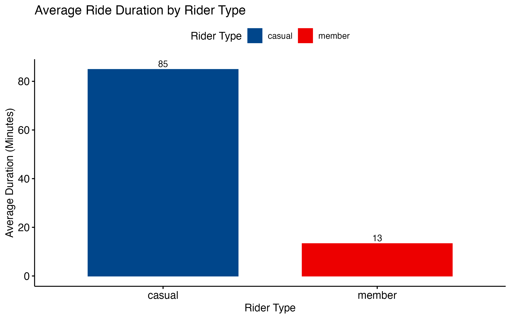
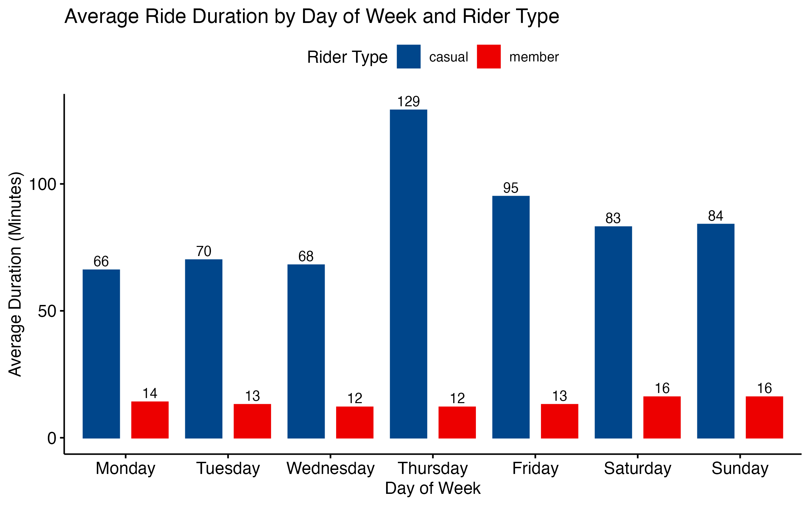
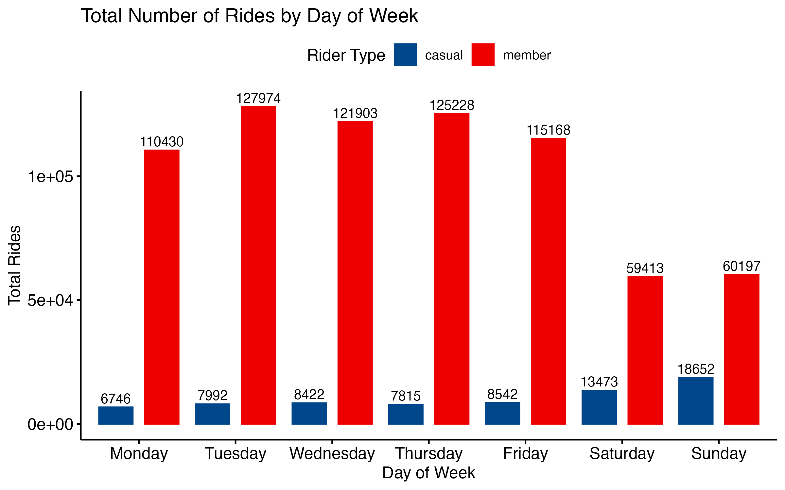
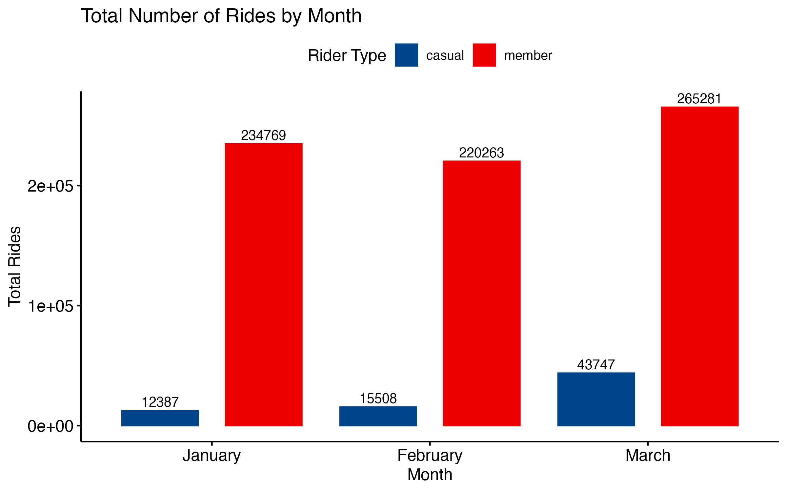
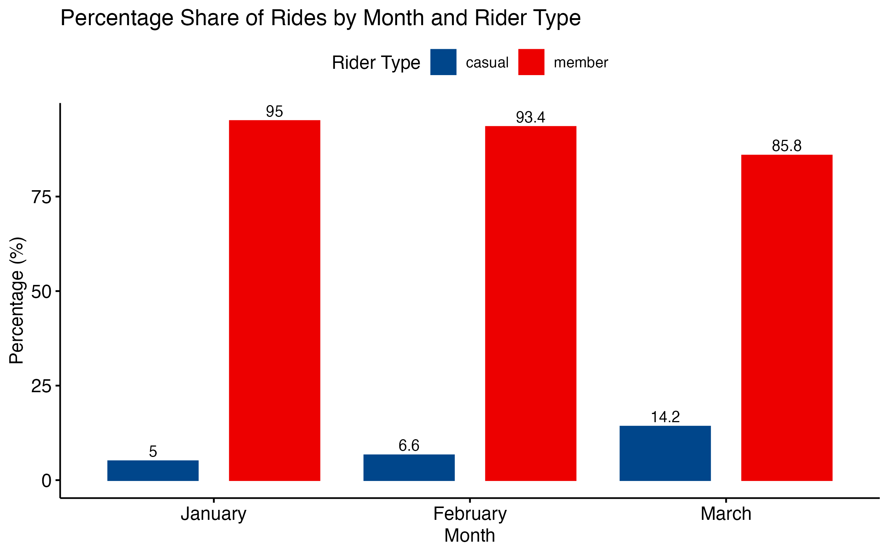

# Cyclistic Bike-Share Analysis: Casual Riders vs. Annual Members

*by Gabriel D. Román Meléndez*

## Overview

This project analyzes Cyclistic’s historical bike-share data to reveal key differences between casual riders and annual members.
The primary goal is to inform targeted marketing strategies aimed at converting casual riders into profitable annual memberships.

**Tools Used:** `R`, `tidyverse`, `ggpubr`, `janitor`, `lubridate`

## Business Objective

Cyclistic’s marketing team seeks clear, actionable insights on rider behavior differences to:

- Convert casual riders into annual subscribers.
- Maximize annual membership revenue.
- Increase rider retention.

## Data

- **Source:** Cyclistic (Motivate International Inc.)
- **Period:** Q1 2019, Q1 2020
- **Data format:** CSV files

## Key Insights

### **Average Ride Duration by Rider Type**

**Insight:** Casual riders average significantly longer rides, indicating leisure-oriented trips.

### **Average Ride Duration by Day of Week and Rider Type**

**Insight:** Casual riders favor weekends for longer rides; members have shorter weekday rides consistent with commuting.

### **Total Number of Rides by Day of Week and Rider Type**

**Insight:** Casual rider activity spikes on weekends, while members are consistently active on weekdays.

### **Monthly Trends in Ride Counts by Rider Type**

**Insight:** Clear seasonal growth from winter (January) to spring (March) among casual riders.

### **Percentage Share of Rides by Rider Type and Month**

**Insight:** Casual riders’ proportion increases notably from winter to spring, providing clear seasonal marketing opportunities.

## Strategic Recommendations

1. **Weekend and Seasonal Promotions:**  
   Target casual riders during peak leisure periods and seasonal increases.

2. **Weekday Commuter Conversions:**  
   Highlight convenience, reliability, and cost-saving of annual memberships.

3. **Personalized Engagement and Loyalty Programs:**  
   Incentivize casual riders through tailored loyalty and reward initiatives.

## View the Complete Analysis

- [R Markdown file (`cyclistic_analysis.Rmd`)](cyclistic_analysis.Rmd)
- [Interactive HTML Report (`cyclistic_analysis.html`)](cyclistic_analysis.html)

## Author

- Gabriel D. Román Meléndez
- Data Analyst proficient in R, data visualization, statistical analysis, and storytelling.

## License

This analysis was completed as part of the [Google Data Analytics Professional Certificate](https://grow.google/certificates/data-analytics/).
This repository, including scripts and analysis, is licensed under the MIT License.